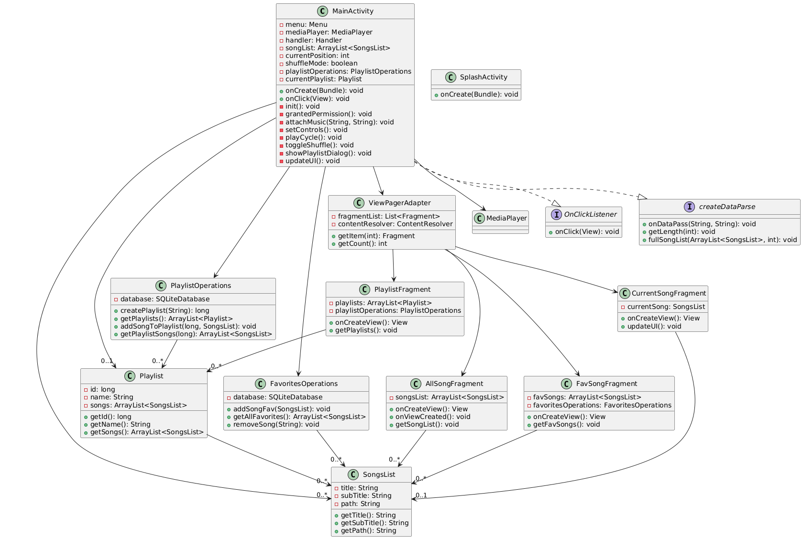

# Android Music Player Application

## Overview
An interactive Android music player application that provides a seamless music playback experience with features like playlist management, favorites, and local storage integration.

## Designed for Semester 4's Mobile Application Development Project 
 
## Developers
- Arjun Mehta (K036)
- Dakshita Galhotra (K021)
- Jal Bafana (K005)

## Features

### Core Functionality
- 🎵 Local MP3 playback
- 📱 Interactive UI with intuitive controls
- 🔍 Song search functionality
- 🎨 Modern Material Design interface

### Music Management
- 📂 Access to local storage MP3 files
- ⭐ Favorites playlist system
- 📝 Custom playlist creation
- 🎶 Currently playing queue
- 🔄 Shuffle and repeat modes

### Technical Features
1. **Navigation System**
   - Drawer navigation for easy access
   - ViewPager implementation
   - Tab-based interface

2. **Data Management**
   - SQLite database integration
   - Persistent storage for playlists
   - Favorites management system

3. **UI Components**
   - Fragment-based architecture
   - Custom adapters for lists
   - Material Design components

## Architecture

### Components
1. **Activities**
   - MainActivity: Core playback and control
   - SplashActivity: Application entry point

2. **Fragments**
   - AllSongFragment: Displays all available songs
   - FavSongFragment: Manages favorite songs
   - CurrentSongFragment: Shows current playlist
   - PlaylistFragment: Handles playlist operations

3. **Database**
   - FavoritesDBHandler: Manages favorite songs
   - PlaylistDBHandler: Handles playlist operations
   - SQLite implementation for persistent storage

4. **Adapters**
   - SongAdapter: Handles song list display
   - PlaylistAdapter: Manages playlist views
   - ViewPagerAdapter: Controls fragment navigation

### Data Models
1. **SongsList**
   - Title
   - Subtitle (Artist)
   - File path

2. **Playlist**
   - Playlist ID
   - Name
   - Song collection

## Technical Implementation

### UML Diagram
<p align="center">
  
</p>

### Database Schema
1. **Favorites Table**
```sql
CREATE TABLE favorites (
songID INTEGER,
title TEXT,
subtitle TEXT,
songpath TEXT PRIMARY KEY
)
```

2. **Playlists Table**

```sql
CREATE TABLE playlists (
playlistId INTEGER PRIMARY KEY AUTOINCREMENT,
playlistName TEXT UNIQUE
)
```


3. **Playlist Songs Table**
```sql
CREATE TABLE playlist_songs (
playlistId INTEGER,
songId INTEGER,
title TEXT,
subtitle TEXT,
songpath TEXT,
PRIMARY KEY (playlistId, songpath),
FOREIGN KEY (playlistId) REFERENCES playlists(playlistId) ON DELETE CASCADE
)
```


## Setup and Installation

### Prerequisites

- Android Studio 4.0+
- Android SDK 21+
- Java Development Kit (JDK) 8+

### Build Instructions

1. Clone the repository:
```bash
git clone https://github.com/yourusername/android-music-player.git
```

2. Open in Android Studio:
- Launch Android Studio
- Select "Open an existing Android Studio project"
- Navigate to the cloned directory

3. Build the project:
```bash
./gradlew build
```

4. Run on emulator or device:
- Select your device/emulator
- Click "Run" (▶️)

## Permissions Required
- `READ_EXTERNAL_STORAGE`: Access local music files
- `WRITE_EXTERNAL_STORAGE`: Manage playlists and favorites


## License
This project is licensed under the MIT License
